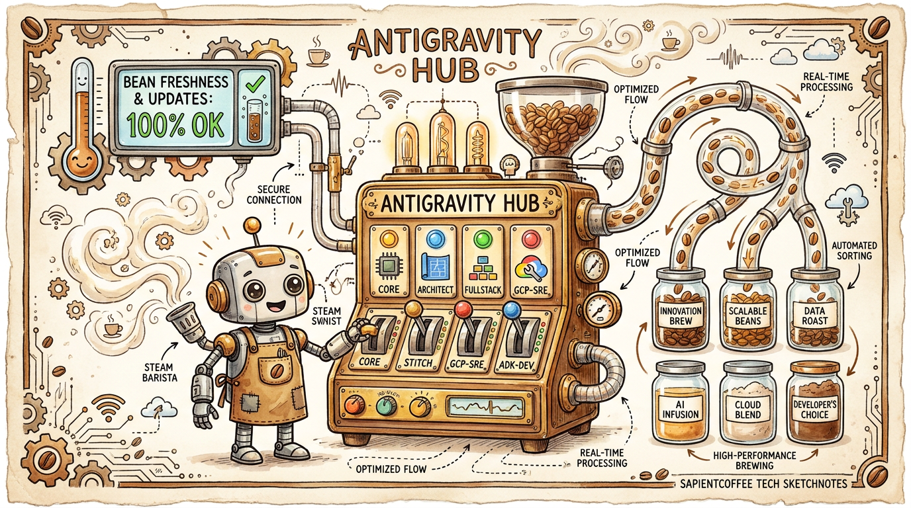
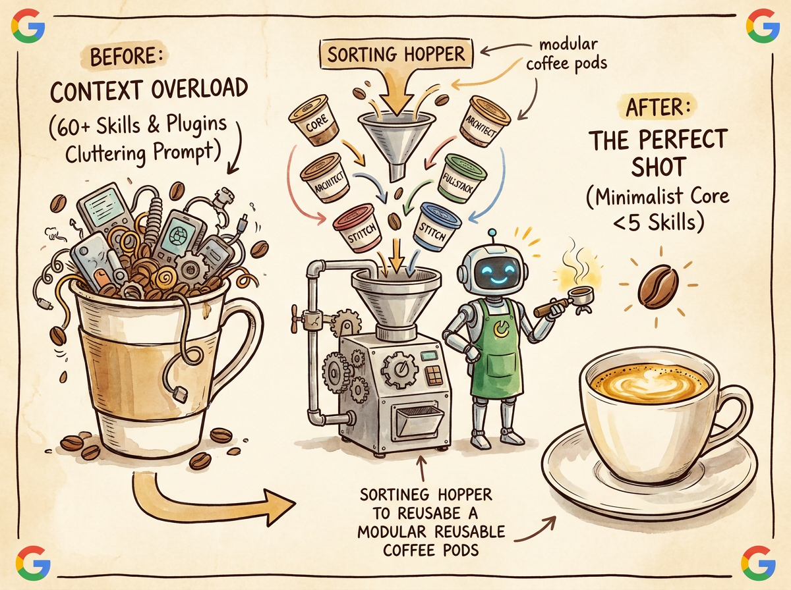
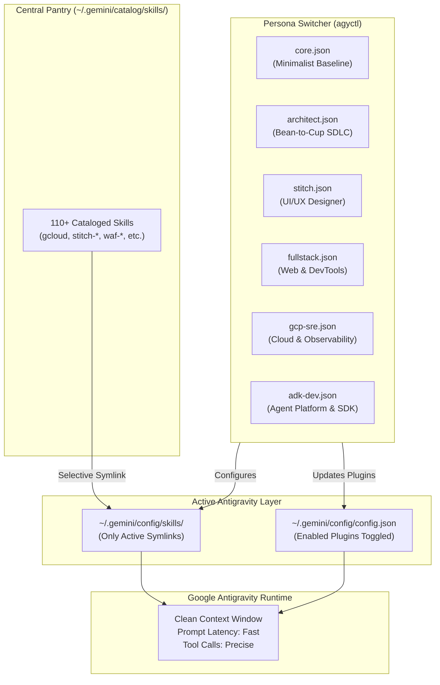
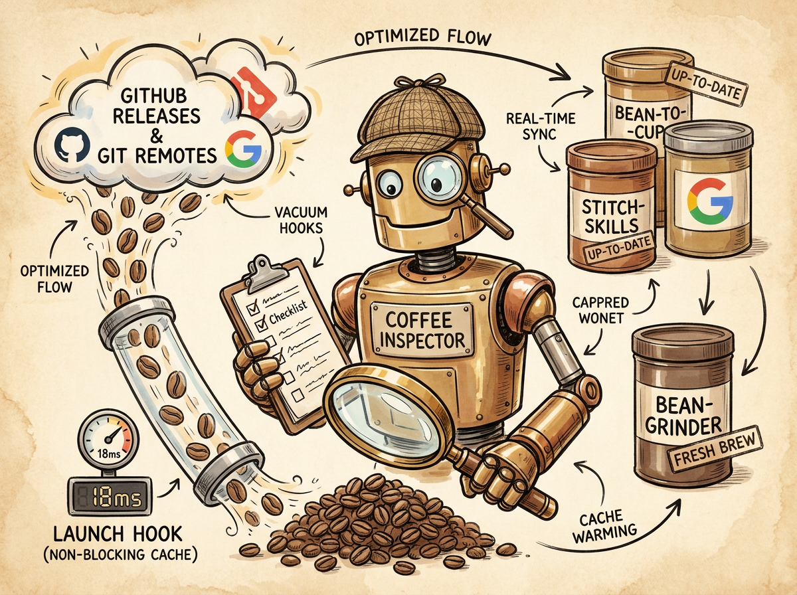

> [!WARNING]
> **Demo & Proof-of-Value Notice**: This repository contains demonstration and proof-of-value examples designed to illustrate AI-assisted engineering and autonomous agent workflows.
>
> - **Do Not Use Directly with Production Code**: This project is not intended for direct, out-of-the-box production deployment. Do not use these workflows, tools, or code samples directly in production environments without comprehensive testing and security audits.
> - **Review and Adopt**: We strongly recommend that you thoroughly review, validate, and adapt these concepts and patterns to build your own implementation tailored to your organization's specific requirements, architecture, and security policies.
> - **Disclaimer**: Provided strictly "as-is" for evaluation, educational, and reference purposes under the Apache-2.0 license, without warranties or SLA commitments of any kind.

<p align="center">
  
</p>

# 🎛️ Antigravity Control (`antigravity-control` / `agyctl`)

> **Dynamic Persona Switcher, Minimalist Skill/Subagent Curator, and Plugin Version Audit Engine for Google Antigravity (`agy` CLI and Hub).**

**Antigravity Control (`agyctl`)** provides an intelligent control room for your Google Antigravity environment. It cures **customization bloat** by keeping your active context clean and minimalist, allowing you to load and unload skills, subagents, and plugins on demand based on your active persona or immediate task. It also provides an automated version-checking engine and launch hook that audits upstream Git remotes and GitHub releases to keep your environment fresh without slowing startup.

---

## ☕ Why "Antigravity Control"? (The Metaphor Explained)

<p align="center">
  
</p>

In specialty coffee brewing, you don't dump every single roast, origin, grind size, and syrup bottle into one cup and hope for a masterpiece. That results in bitter, murky sludge. You grind **only the specific beans** required for that exact extraction—a crisp Ethiopian pour-over for clarity, or a dense espresso roast for a cortado.

In AI engineering, loading 60+ skills, multiple agent prompt wrappers, and 8 plugins into every single session turn creates **Context Overload**:
1. **Token Bloat**: Giant system prompts waste context window tokens before your code is even inspected.
2. **Attention Drift & Hallucinations**: When the LLM has 60 tools and instructions loaded simultaneously, tool-call accuracy degrades and execution slows.
3. **Startup Lag**: Antigravity spends unnecessary milliseconds discovering, indexing, and validating unneeded directories on every turn.

**`antigravity-control` (`agyctl`)** is the master barista's hopper and switchboard:
- **The Central Bean Catalog (`~/.gemini/catalog/skills/`)**: Stores all 110+ available skills offline in a pristine pantry.
- **The Persona Pod Selector (`agyctl switch`)**: Switches your active environment in milliseconds. Switching to `stitch` loads only design tools; switching to `architect` loads PRD and red-teaming skills; switching to `core` strips everything back down to a razor-sharp minimalist espresso shot (< 5 skills).
- **The Upstream Quality Inspector (`agyctl check`)**: Continuously audits upstream GitHub repositories and Git remotes, letting you know when upstream bean batches receive fresh releases.

---

## 🏛️ Architecture & Discovery Alignment

Antigravity uses a strict hierarchy when discovering plugins and skills:

```
┌──────────────────────────────────────────────────────────────────────────────────────────────────┐
│                             ANTIGRAVITY CONTROL DISCOVERY TAXONOMY                               │
├───────────────────────────────┬───────────────────────────────┬──────────────────────────────────┤
│   Central Skill Catalog       │     Active Context Layer      │      Antigravity Engine          │
│   (~/.gemini/catalog/skills)  │   (~/.gemini/config/skills)   │   (~/.gemini/config/config.json) │
├───────────────────────────────┼───────────────────────────────┼──────────────────────────────────┤
│ • 110+ Offline Skills         │ • Curated symlinks only       │ • Plugin toggles (enabled: T/F)  │
│ • No prompt token overhead    │ • 2-15 skills per persona     │ • SessionStart hooks             │
│ • Fully versioned and safe    │ • Replaced atomically on swap │ • Zero CLI binary modification   │
└───────────────────────────────┴───────────────────────────────┴──────────────────────────────────┘
```



---

## 🎭 Persona Profiles Reference

Antigravity Control ships with 6 curated persona profiles in [`personas/`](personas/):

| Persona | Purpose | Enabled Plugins | Curated Active Skills |
| :--- | :--- | :--- | :--- |
| **`core`** | **Minimalist Baseline**. Fast everyday coding, scripts, and dotfiles maintenance. | `antigravity-control` | `git-delivery`, `agy-customizations`, `antigravity-guide`, `graphify` *(< 5 skills!)* |
| **`architect`** | **Bean-to-Cup SDLC**. Socratic grilling, PRDs, domain modeling, and red-team audits. | `antigravity-control`, `bean-to-cup` | `ideator`, `grill`, `write-prd`, `domain-modeling`, `feature`, `kanban`, `audit-code`, `research`, `sync`, `visual-dashboard` |
| **`fullstack`** | **Web Application Engineering**. React, Vite, Tailwind, and Chrome DevTools debugging. | `antigravity-control`, `modern-web-guidance-plugin`, `chrome-devtools-plugin` | `react-vite-dashboard`, `shadcn-ui`, `a11y-debugging`, `chrome-devtools`, `chrome-extensions`, `debug-optimize-lcp`, `memory-leak-debugging` |
| **`stitch`** | **UI/UX Design Studio**. Google Stitch design generation, screen extraction, and Remotion video walkthroughs. | `antigravity-control`, `stitch-build`, `stitch-design`, `stitch-utilities` | `design-md`, `enhance-prompt`, `stitch-code-to-design`, `stitch-extract-design-md`, `stitch-generate-design`, `stitch-loop`, `stitch-react-components`, `remotion`, `taste-design` |
| **`gcp-sre`** | **Cloud Infrastructure & Reliability**. GCP services, databases, networking, and chaos mitigation. | `antigravity-control` | `gcloud`, `cloud-run-basics`, `cloud-sql-basics`, `alloydb-basics`, `bigquery-basics`, `gke-basics`, `google-cloud-waf-*`, `iam-recommendations-fetcher`, `chaos-mitigation` |
| **`adk-dev`** | **AI Agent Platform Engineering**. Google ADK, Agent Platform, and Antigravity SDK. | `antigravity-control`, `google-antigravity-sdk` | `google-agents-cli-*`, `agent-platform-eval-flywheel`, `agent-platform-model-registry`, `agent-platform-prompt-management`, `gemini-agents-api` |

---

## 🔍 Upstream Freshness & Update Engine

<p align="center">
  
</p>

Installed plugins often receive upstream updates (new skills, updated schemas, bug fixes). Tracking them manually across dozens of repositories is tedious.

**`agyctl`** provides a native, concurrent upstream audit engine:
1. **GitHub Releases & Tags**: Direct HTTPS queries to the GitHub API with token auth (`GITHUB_TOKEN`, `GH_TOKEN`, or `gh auth token`), with fallback to the `gh api` CLI.
2. **Git Remotes**: For workspace checkouts or git-based plugins, executes non-blocking `git ls-remote` inspections with strict timeouts to detect upstream commit drift.
3. **Concurrent Worker Pool**: Audits all installed plugins in parallel using bounded goroutines, finishing audits across dozens of plugins in ~1 second.
4. **Sub-3ms Launch Hook (`agyctl hook session-start`)**:
   - Executes automatically upon every Antigravity session start (`SessionStart`).
   - Uses a **6-hour cache (`TTL=21600`)** so CLI startup takes **< 3ms**.
   - If updates are detected, injects an actionable Markdown notification into the session context:

```markdown
### 🔄 Antigravity Plugin Updates Available
> Found **4** plugin(s) with newer versions upstream:

- **`bean-grinder`**: `1.0.2` ➔ `b10cacf` (commit ebea41c -> b10cacf)
- **`stitch-build`**: `1.0.0` ➔ `1.0` (1.0.0 -> 1.0)
- **`stitch-design`**: `1.0.0` ➔ `1.0` (1.0.0 -> 1.0)
- **`stitch-utilities`**: `1.0.0` ➔ `1.0` (1.0.0 -> 1.0)

Run `agyctl update` to update.
```

---

## 🛠️ Step-by-Step Installation

Clone or locate the repository under `~/workspace/antigravity-control` and run the automated setup script:

```bash
cd ~/workspace/antigravity-control
./scripts/setup.sh
```

### What `setup.sh` Executes:
1. **Populates Skill Catalog**: Safely harvests all existing skills from `~/.agents/skills/` into `~/.gemini/catalog/skills/`.
2. **Installs Persona Profiles**: Copies all persona definition profiles into `~/.gemini/personas/`.
3. **Builds Native Go Binary**: Compiles `bin/agyctl` from `cmd/agyctl` with Go.
4. **Installs Global CLI Tools**: Symlinks `agyctl` into `~/.local/bin/agyctl`.
5. **Registers Plugin & Hook**: Links `antigravity-control` into `~/.gemini/config/plugins/` so its `SessionStart` hook is active.
6. **Quarantines Home Directory Sprawl**: Backs up and cleans `~/.agents/skills/` so starting a shell in `$HOME` does not inject 60+ unmanaged skills.
7. **Applies Minimalist Core**: Sets the active persona to `core` by default using `agyctl switch core`.

---

## 💡 Practical Examples & Walkthroughs

### Example 1: Morning Check & Minimalist Baseline
Start your day with a lightning-fast, uncluttered Antigravity environment:
```bash
# Check current persona and loaded components
agyctl current

# Output:
# Active Persona : Minimalist Core (core)
# Description    : Minimalist baseline for everyday development, dotfiles, and general coding.
# Active Skills  (2): git-delivery, graphify
# Active Plugins (1): antigravity-control
```

### Example 2: Switching to Google Stitch for UI/UX Design
You need to generate mockup screens and build a design system:
```bash
agyctl switch stitch

# Output:
#  switched to persona: Stitch UI/UX Designer (stitch)
#    Description: Google Stitch UI/UX design generation, design systems, and Remotion walkthroughs.
#    Plugins enabled : stitch-utilities, antigravity-control, stitch-build, stitch-design
#    Skills active   : 17 loaded
```

Now launch `agy`. Your Antigravity session will have Stitch tools, MCP design system commands, and Remotion skills loaded—and nothing else.

### Example 3: Running a PRD Workshop with the Architect Persona
You want to run a Socratic requirements interview using the Bean-to-Cup methodology:
```bash
agyctl switch architect
```
All Bean-to-Cup SDLC skills (`grill`, `ideator`, `write-prd`, `kanban`, `visual-dashboard`) are instantly mounted.

### Example 4: Temporarily Loading a Single One-Off Skill
You are in `core` mode and just need to run one Google Cloud command without switching your whole persona:
```bash
# Temporarily mount gcloud skill
agyctl load gcloud

# Once done, unload it
agyctl unload gcloud
```

### Example 5: Auditing and Updating Plugins
Inspect the health of your installed plugins against upstream:
```bash
# Run an audit
agyctl check

# Update all outdated plugins with one command
agyctl update all

# Or update a specific plugin
agyctl update bean-to-cup
```

---

## 📋 `agyctl` Command Cheat Sheet

### Persona & Context Commands
| Command | Shortcut | Description |
| :--- | :--- | :--- |
| `agyctl persona list` | `agyctl list` / `agyctl personas` | List all available personas with description, plugins, and skill counts |
| `agyctl persona switch <name>` | `agyctl switch <name>` | Switch active persona (`core`, `architect`, `fullstack`, `stitch`, `gcp-sre`, `adk-dev`) |
| `agyctl persona current` | `agyctl current` / `agyctl status` | Display active persona, loaded skills list, and enabled plugins |
| `agyctl persona reset` | `agyctl reset` | Return to minimal baseline (`core` profile) |
| `agyctl persona load <name>` | `agyctl load <name>` | Temporarily load an individual skill or plugin into the active session |
| `agyctl persona unload <name>` | `agyctl unload <name>` | Temporarily unload a skill or plugin |

### Plugin Version & Update Commands
| Command | Shortcut | Description |
| :--- | :--- | :--- |
| `agyctl plugins check` | `agyctl check` | Check installed plugins against upstream GitHub releases and Git remotes |
| `agyctl plugins update [all\|name]` | `agyctl update [name]` | Pull latest upstream commits or release updates |
| `agyctl plugins list` | `agyctl plugins` | List local versions and configurations of all installed plugins |

### Lifecycle Hooks & Utility Commands
| Command | Shortcut | Description |
| :--- | :--- | :--- |
| `agyctl hook session-start` | - | Non-blocking, cached upstream check for Antigravity SessionStart (< 3ms cached) |
| `agyctl version` | - | Display the agyctl release version |

---

## 🧪 Automated Testing & Build

Antigravity Control is built with Go and Cobra. You can run the complete unit and end-to-end test suite using Go:

```bash
cd ~/workspace/antigravity-control
go test -v ./...
```

To compile the native `bin/agyctl` binary:
```bash
go build -o bin/agyctl ./cmd/agyctl
```

You can also run the legacy integration test suite:
```bash
python3 -m unittest discover tests/
```

---

## ☕ The Sapient Barista Family

Antigravity Control works seamlessly alongside the rest of the Autonomous Barista Swarm:

*   **[Bean-to-Cup](https://github.com/sapientcoffee/bean-to-cup)**: Autonomous SDLC pipeline, Socratic requirements grilling, and TDD execution.
*   **[Bean-Grinder](https://github.com/sapientcoffee/bean-grinder)**: AST transformation, codmod analysis, and legacy monolith deconstruction.
*   **[Bean-Brewer](https://github.com/sapientcoffee/bean-brewer)**: Clean vertical-slice implementation and verified delivery.
*   **Antigravity Control (`agyctl`)**: The master switchboard ensuring each barista has only the tools they need for the perfect pour.

---

## 📄 License

Licensed under the [Apache License, Version 2.0](LICENSE).
